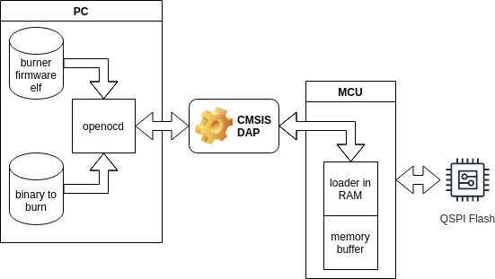
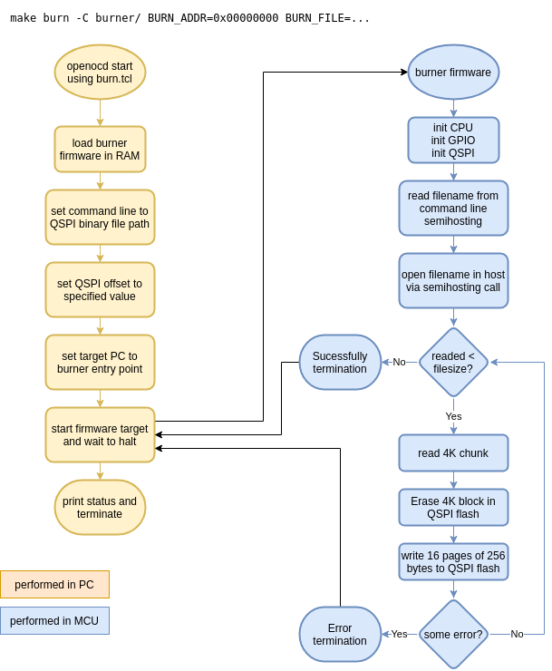

# STM32H7 QSPI flash loader

Binary project for load QSPI memory via semihosting using openocd (this binary load and run in RAM)

This project provides a firmware that can load in ram, expecting file name (via semihosting command
line) and address for burn external flash reading the selected file using semihosting calls (probed
with openocd)



The control flow of burner is like this:



To perform a burn in QSPI you need this project as a subproject of your program (by example in a
`burner/` directory) and do this:

```sh
make burn -C burner/ BURN_ADDR=0x00000000 BURN_FILE=path/to/my/binary-file.bin
```

This build, load in ram and run burner with parameters `BURN_ADDR` (for flash address to store file)
and `BURN_FILE` as source file to burn in flash.
